# Set up IBM Bob for working with watsonx Orchestrate

There are several steps required to ensure IBM Bob is ready to build and deploy agents to watsonx Orchestrate.

## Pre-requisites

* IBM Bob - [Sign up for a free trial](https://bob.ibm.com/trial/?utm_source=developer-content&cm_sp=ibmdev-_-developer-_-trial)
* Python version 3.12
* uvx - a command-line tool provided by the [uv Python package manager](https://docs.astral.sh/uv/guides/tools/)
* An IBM Cloud or AWS instance of watsonx Orchestrate

## Steps

### Create a new Bob project

Open IBM Bob IDE and create a new workspace for this project:

1. Click on **File** → **Open Folder**
2. Select the path where you want to store your project, click on **New Folder**, and name it 'wxo-agents-with-bob'.

### Configure the Python interpreter and create a new virtual environment

1. Press *Shift* + *Command* + *P* to open the command palette.
2. Type *Select Interpreter* and select the Python interpreter you want to use (Python 3.12):
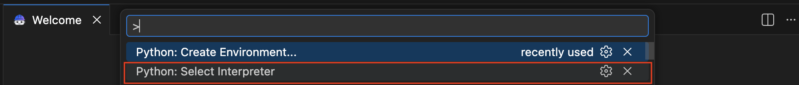
3. Click on *Create Virtual Environment* and select **Python: Create environment**
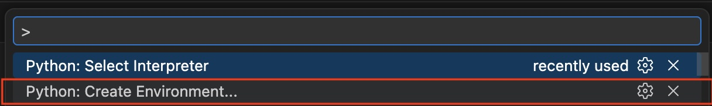
4. Select **Venv** to create a .venv virtual environment in the current workspace
5. Select the Python 3.12 interpreter in your path
6. Rename the **.venv** folder in your workspace to **venv**

### Configure watsonx Orchestrate MCP servers

Next, we will configure IBM Bob so it can connect to the watsonx Orchestrate MCP servers:

* **watsonx Orchestrate ADK MCP Server** - The watsonx Orchestrate ADK MCP Server is a Model Context Protocol server that provides tools for performing actions available in the Orchestrate ADK, such as agent, tool, and knowledge base creation. Access to this server provides Bob with the ability to create and manage agents, tools, knowledge bases, and connections.

* **watsonx Orchestrate ADK Documentation MCP Server** - The watsonx Orchestrate Documentation MCP Server acts as a standalone MCP server that exposes a tool for searching watsonx Orchestrate documentation. Access to this server provides Bob with the ability to search watsonx Orchestrate documentation and understand how to use the ADK commands.

**Note:** instructions below explain how to set up access to wxO MCP servers for your specific project only. If you want to set up access to wxO MCP servers for all projects, you can add the MCP servers to the global .bob/mcp.json file instead (typically located under <USER_HOME>/.bob)

Create a new file in your project in the .bob folder and name it **mcp.json**. This file stores configurations needed for Bob to connect to the wxO MCP servers. Copy the following contents, taking care to update the value for **WXO_MCP_WORKING_DIRECTORY** to contain the absolute path to your current project:

```
{
     "mcpServers": {
         "watsonx-orchestrate-adk-docs": {
             "command": "uvx",
             "args": [
                 "mcp-proxy",
                 "--transport",
                 "streamablehttp",
                 "https://developer.watson-orchestrate.ibm.com/mcp"
             ],
             "alwaysAllow": [
                 "search_ibm_watsonx_orchestrate_adk"
             ]
         },
         "watsonx-orchestrate-adk": {
             "command": "uvx",
             "args": [
                 "--with",
                 "ibm-watsonx-orchestrate==2.7.0",
                 "--with",
                 "fastmcp==2.14.5",
                 "ibm-watsonx-orchestrate-mcp-server==2.7.0"
             ],
             "env": {
                 "WXO_MCP_WORKING_DIRECTORY": "/Users/yana/Documents/Code/wxo-agents-with-bob",
                 "WXO_MCP_DEBUG": ""
             },
             "timeout": 300
         }
     }
 }
```

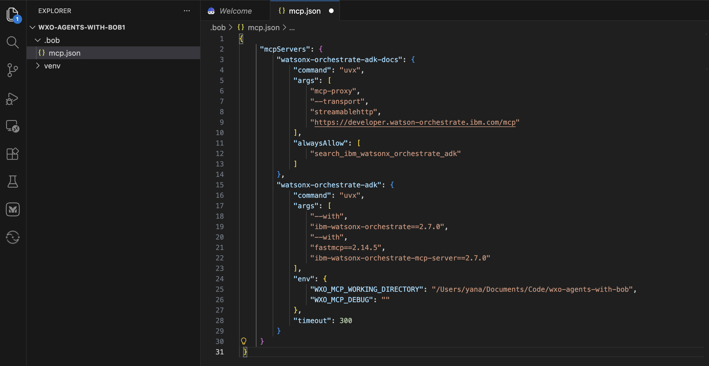

Note that at the time of this writing (April 2026) version 2.7.0 is recommended with the settings as indicated above.

### Install the watsonx Orchestrate ADK Visual Studio extension and initialize the workspace

Orchestrate ADK Extension is a Visual Studio Code (VS Code) extension that helps you build agents more efficiently. It automatically creates workspaces, assists with agent and tool file creation, and helps you manage watsonx Orchestrate Developer Edition and ADK versions.  

To install the extension, follow the steps below: 

1. Open the extensions tab: Press **Ctrl + Shift + X** or click the extensions icon on the left sidebar to open the extensions marketplace.  Search for **watsonx Orchestrate ADK** in the search bar:

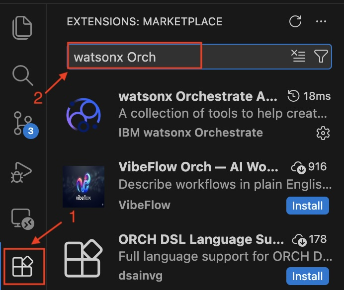

3. Click on the watsonx Orchestrate ADK extension from the results and **Install** the extension: 

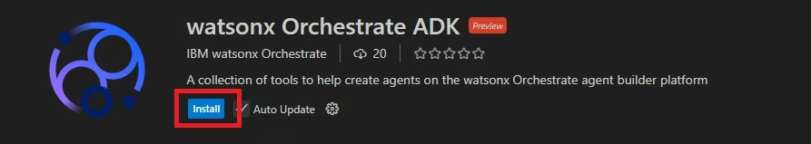

Next, initialize the workspace by doing the following:

* Select the **watsonx Orchestrate** icon in the left panel and click on **Initialize Workspace**:

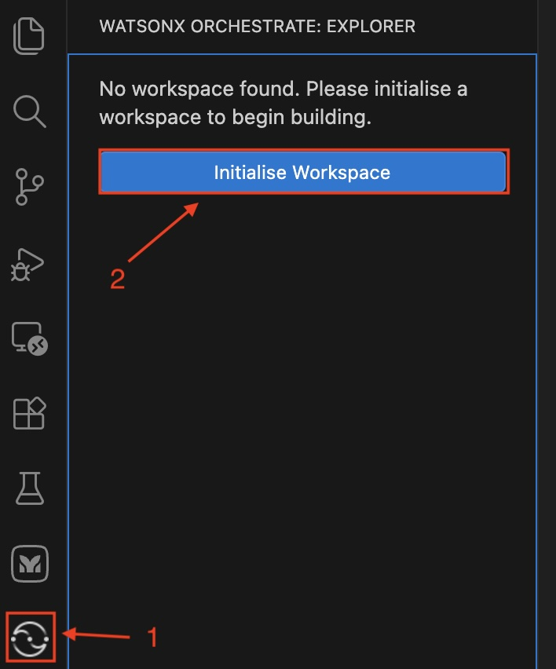

**Troubleshooting Notes**

1. If you get an error message (in the bottom right corner of the Bob UI) **Failed to install package 'virtualenv'. Please manually install the package using `pip install virtualenv`.**, this may be because your Python interpreter is not set up correctly.  To resolve this, using the following instructions: 

- Press *Shift* + *Command* + *P* to open the command palette.
- Type *Select Interpreter* and select the Python interpreter you want to use (it should point to **the one in your venv folder** you created earlier.
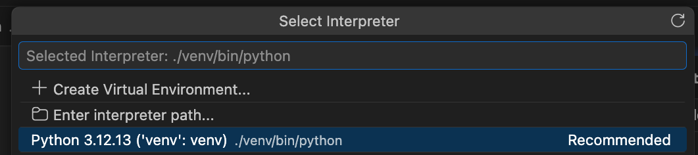

2. You may get an error message **Failed to list agents**. You can safely ignore it as you haven't yet activated your watsonx Orchestrate environments (this will be done in the next step).


### Configure your project and activate the watsonx Orchestrate instance (SaaS)

The ADK extension will automatically create folders in your project to view and manage the artifacts available in your watsonx Orchestrate instance.

Now we need to activate the environment:

1. In the **Environment Manager**, add your SaaS instance by using the **Add+** button:

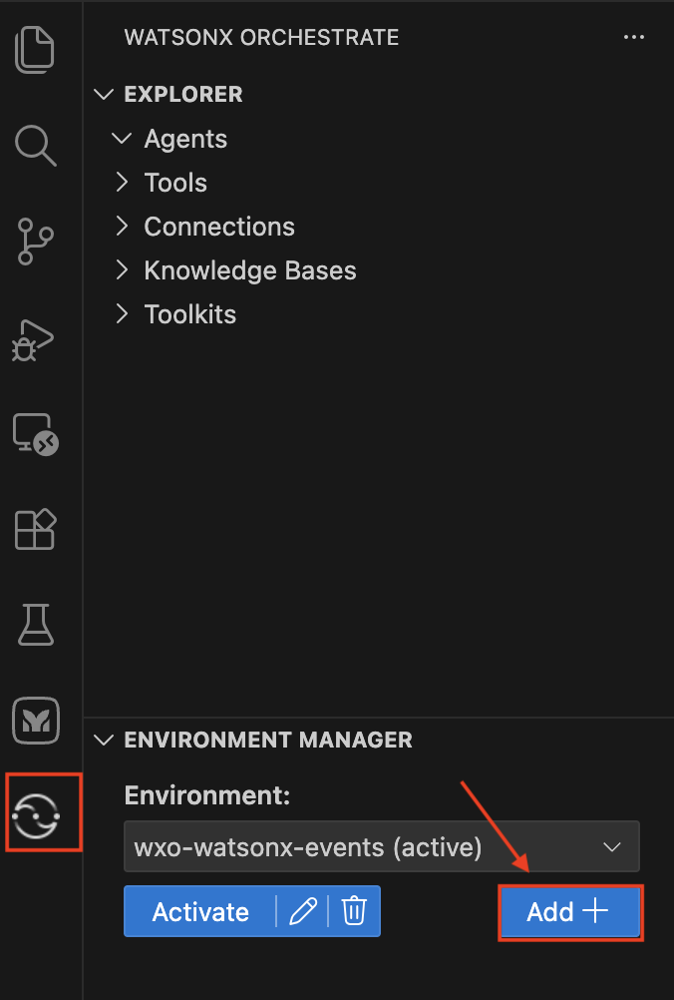

2. Give it a name (can be anything - this will be a nickname for your wxO tenant) and provide the Service Instance URL of your tenant (see below for instructions on where to get it):

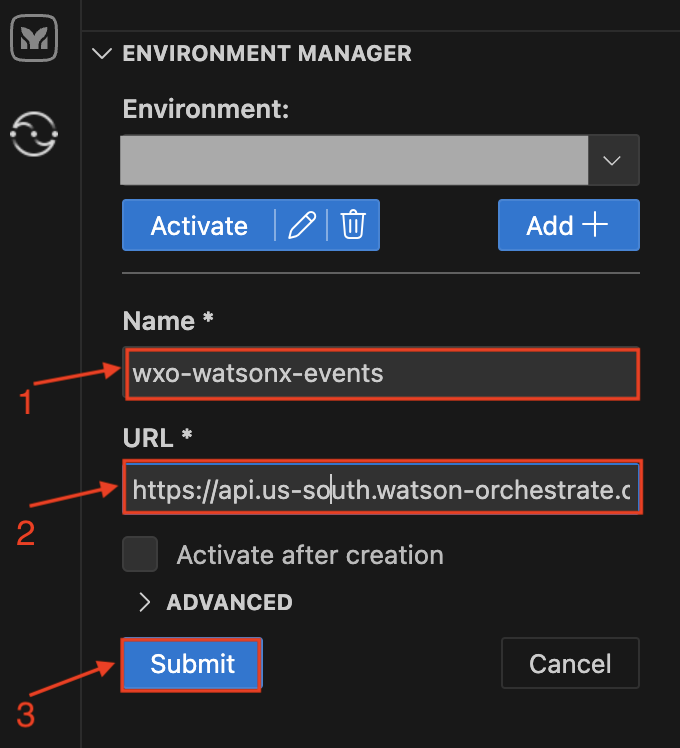

The service URL can be obtained by logging into your SaaS watsonx Orchestrate instance, selecting your profile, then **Settings** → **API Details**:

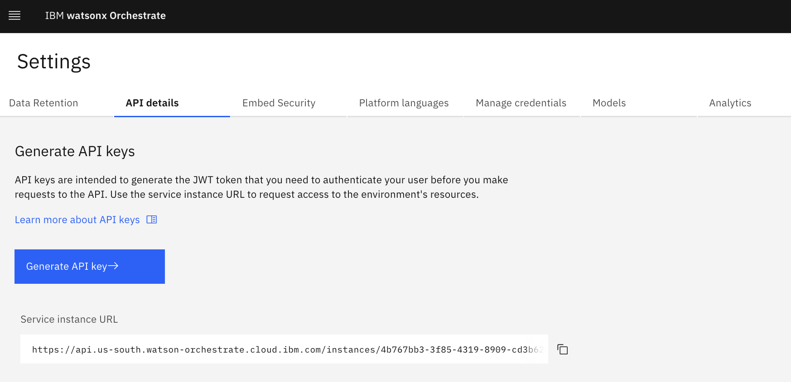

3. Select the env you just created in the drop-down menu and click on **Activate**:

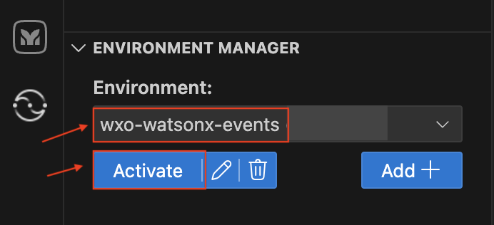  

4. If you are activating your IBM Cloud wxO environment, enter your IBM Cloud API key and click **Enter** (similarly, for an AWS environment, provide the API key you obtained from **Settings->API Details->Generate API key** in wxO):

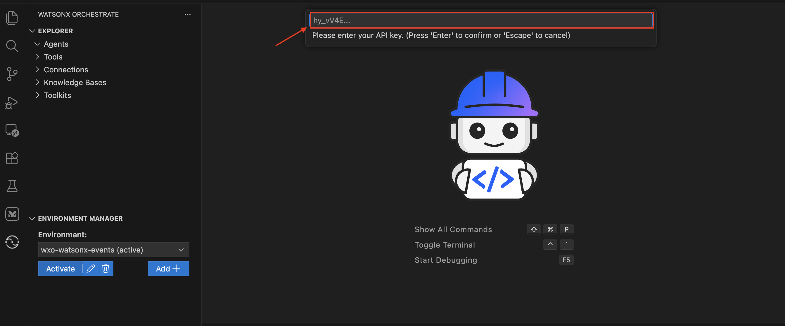

You will see a message in the bottom right corner of the Bob UI indicated that the environment has beeen activated.

After the environment has been activated, the watsonx Orchestrate ADK extension displays the agents, tools, connections, knowledge bases, and toolkits available in the connected environment:

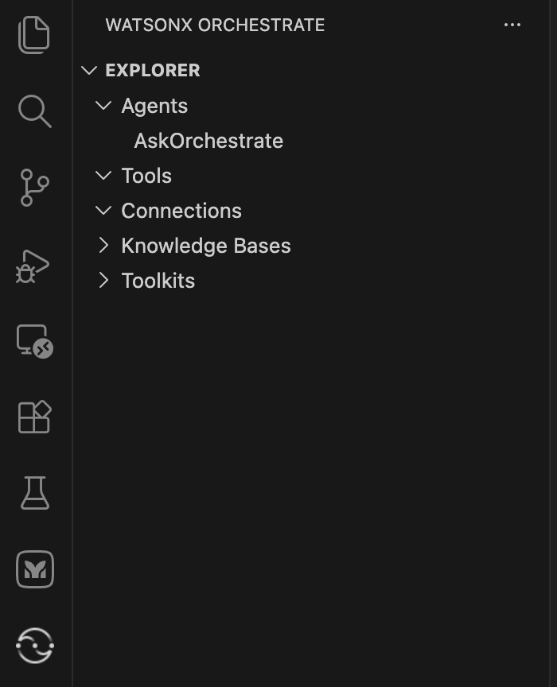

### Download the Bob watsonx Orchestrate skills

Bob skills use a standard format for agent skills that isn't specific to Bob. The Bob watsonx Orchestrate skills provide condensed and clear guidance about the watsonx Orchestrate programming model. They are coding-agent agnostic, i.e. work with any agent that supports the format. They reduce reliance on long, noisy documentation searches and enable greater accuracy.

Relying exclusively on the Documentation MCP Server for the full programming model can lead to large context sizes. This may limit the agent’s ability to generate non-trivial examples and often requires frequent guidance. The solution is to use pre-built watsonx Orchestrate skills for Bob.

To install the skills, do the following:

1. Make sure you are in **Advanced** mode. Type the following in the Bob chat window and click **Send**:

```
Download wxo-builder skill
```

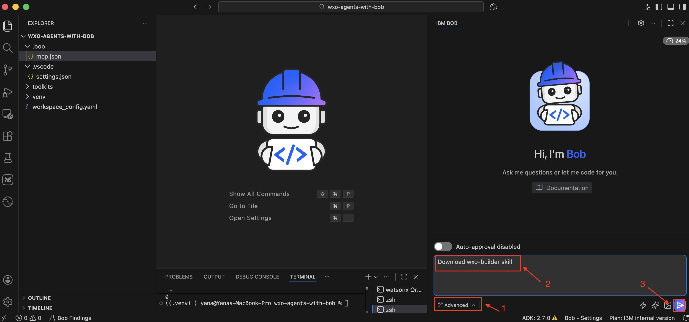

You will now see that Bob will try to use the **list_available_skills** tool on the ADK MCP server to list all available skills:

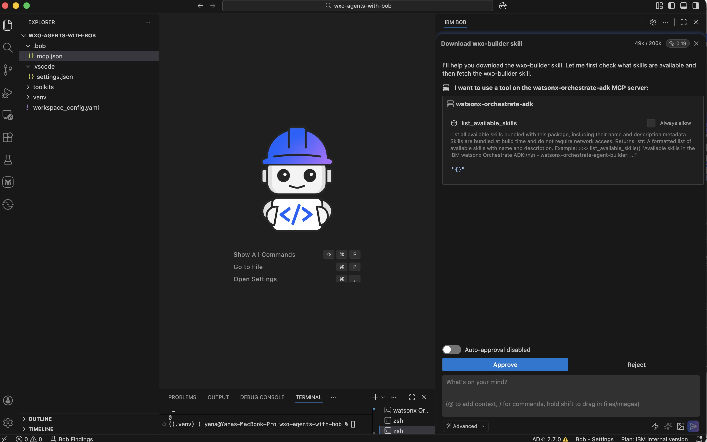

2. Click **Approve**. Next, Bob will try to fetch the wxo-builder skill:

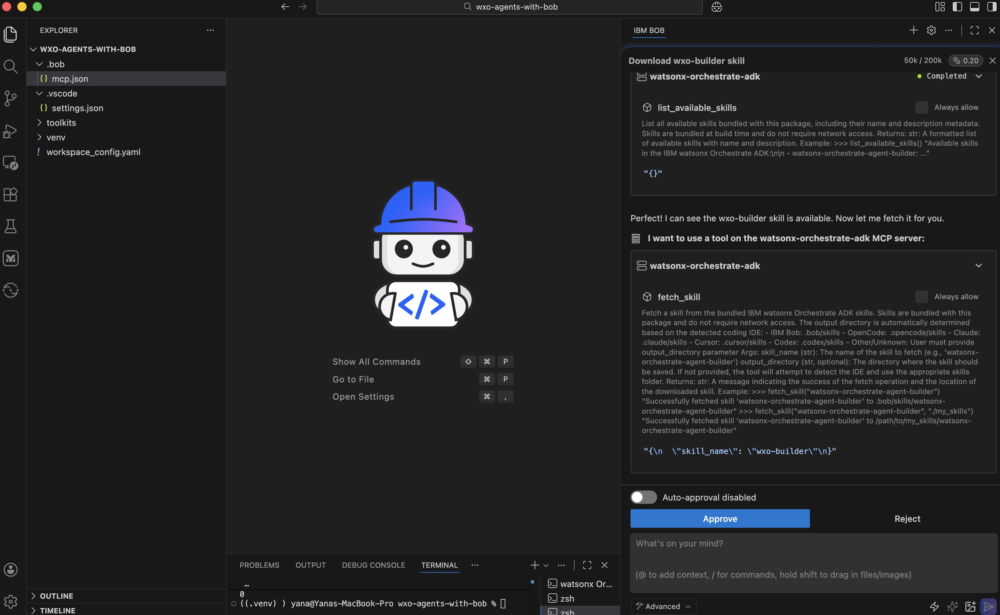

3. Click **Approve** again. You can see that the skill has been downloaded successfully and is now available under **.bob/skills**:

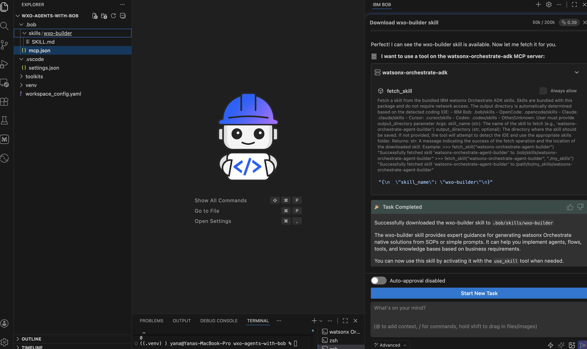

### Clone the watsonx Orchestrate ADK repo for helpful code examples

In addition to the wxo-builder skill, it is also helpful to provide Bob with access to existing examples and code samples in the ADK. The recommended approach is to clone the watsonx Orchestrate ADK repository directly in the project. Agents perform better when ADK examples are available locally. Open a Bob terminal (**IBM Bob** → **Terminal** → **New Terminal**) and clone the ADK repo:

```
git clone https://github.com/IBM/ibm-watsonx-orchestrate-adk
```

You will now see the **ibm-watsonx-orchestrate-adk** folder in your project directory.

### Install any additional skills needed

You can download other skills you may need from MCP servers, or if you have them available locally you could add them directly to **.bob/skills** folder.

### If you plan to deploy applications/websites to Code Engine

If you plan to deploy applications/websites to Code Engine, you will need to install the [IBM Cloud Code Engine CLI](https://cloud.ibm.com/containers/serverless/cli).