## Table of Contents

- [Use Case description](#use-case-description)
- [Architecture](#architecture)
- [Pre-requisites](#pre-requisites)
- [Instructions](#instructions)
  - [Open Agent Builder](#open-agent-builder)
  - [Create HR Agent](#create-hr-agent)
  - [Test HR Agent in preview](#test-hr-agent-in-preview)
  - [Test HR Agent in AI Chat](#test-hr-agent-ai-chat)
  - [Review Domain Agents and Tools](#review-domain-agents-and-tools-optional) (Optional)
  - [Test the SAP Employee Support Manager agent](#test-the-sap-employee-support-manager-agent-optional)(Optional)

## Use Case Description

This use case targets developing and deploying an AskHR agent leveraging IBM watsonx Orchestrate, as depicted in the provided architecture diagram. This agent will empower employees to interact with HR systems and access information efficiently through conversational AI. 

In this lab we will build an HR agent in watsonx Orchestrate, leveraging tools and external knowledge to connect to a simulated Human Capital Management System. This agent retrieves relevant information from documents to answer user queries and  allows users to view and manage their profiles.

Additionaly, IBM watsonx Orchestrate provides an easy access to pre-built domain agents and tools, including those in the HR domain, for example SAP Successfactors, Oracle HCM, and Workday. Agents can be created from a template in one click, then modified and extended as needed.  This optinal part of the lab will give you access to the SAP Employee Support Manager Agent that you can see in action by testing out with a few sample queries. 

In a real enterprise scenario it is recommended to start with pre-built domain agents and tools. You can easily create your own agent from an existing template and then modify and extend as needed, for example bringing in additional tools, agents, and connections.

## Architecture


## Pre-requisites

**Instructors**: 
- Check the corresponding [Instructor's guide](https://github.ibm.com/skol/agentic-ai-client-bootcamp-instructors/tree/main/usecase-setup/askhr) repo to set up all environments and backend services.
  > NOTE: the `main` branch contains the latest release code. If you want to use a previous release, download the same [release](https://github.ibm.com/skol/agentic-ai-client-bootcamp-instructors/releases) that will be used for participants' lab. 
- Ensure you have provided an updated OpenAPI Spec located in the instructor repo at `usecase-setup/askhr/HCM_APP/hr.yaml` with the correct URL to your deployed backend service for the lab participants.
- Provide the [list of employees](https://github.ibm.com/skol/agentic-ai-client-bootcamp-instructors/blob/main/usecase-setup/askhr/HCM_APP/users_data.xlsx) and assign one to each student for testing.
- Ensure you have set up a shared watsonx Orchestrate tenant and configured the SAP connections (optional part)

**Participants**:
- Validate that you have access to the right TechZone environment for this lab
- Validate that you have access to the shared wxO tenant (provided by instructor) for the domain agent part (optional)
- Complete the [environment-setup](../../../environment-setup) guide for steps on API key creation and project setup.
- Validate that you have access to a credentials file that your instructor will share with you before starting the labs
- Familiarity with AI agent concepts (e.g., instructions, tools, collaborators...)
- Make sure that your instructor has provided the following:
  - updated **hr.yaml OpenAPI Spec**

## Instructions

### Open Agent Builder

- Log in to IBM Cloud (cloud.ibm.com). Navigate to top left hamburger menu, then to Resource List. Open the AI/Machine Learning section. You should see a **watsonx Orchestrate** service, click to open.

  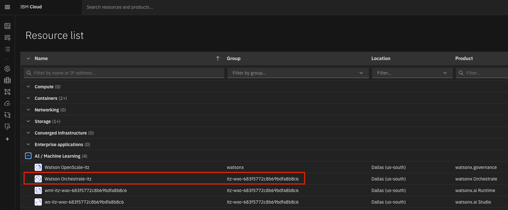

- Click the "Launch watsonx Orchestrate" button.

   

- Welcome to watsonx Orchestrate. Open the hamburger menu, click on the down arrow next to **Build**.  Then click on **Agent Builder**:

   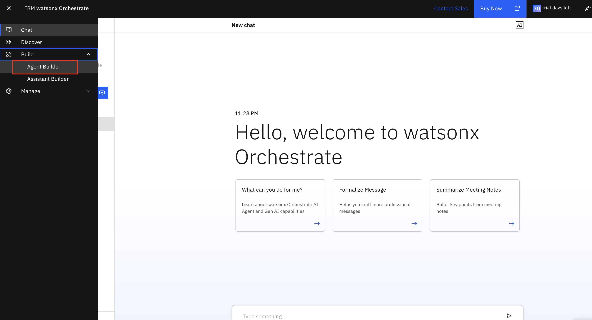

### Create HR Agent
1. Click on **Create agent +**:

   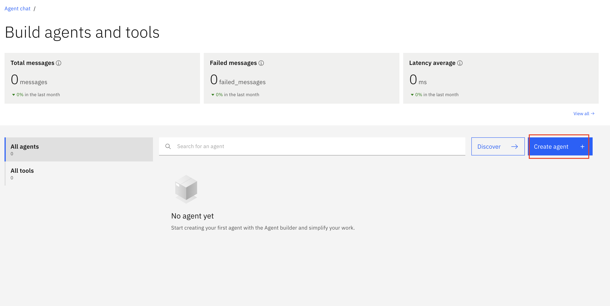

2. Select **Create from scratch**, give your agent a name, e.g. `HR Agent`, and fill in the **Description** as shown below: 

   ```
   This Agent handles employee HR queries including profile lookups, time-off balance checks, title and address updates, time-off requests, and general questions about company benefits.
   ```  
   Click on **Create**:

   

3. Select **Default** in **Agent style** section.

   
  
4. Scroll down the screen to the **Knowledge** section.
   Click on **Add Source**.
   
   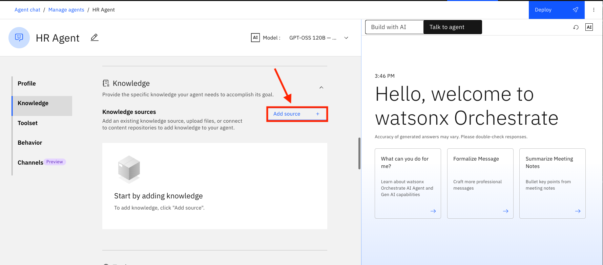
  
5. Select **New Knowledge**
   
   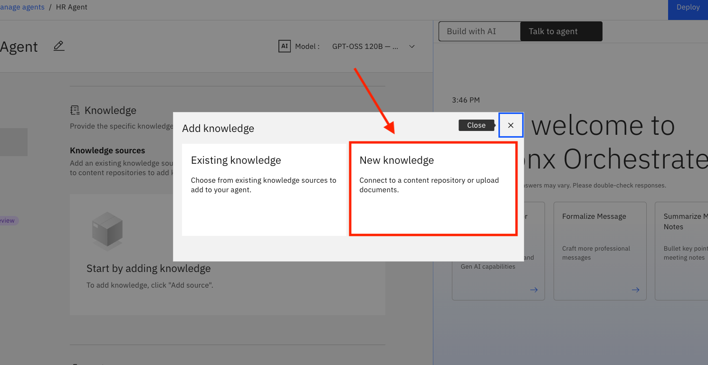 
   
6. Select **Upload files**.
   Click on **Next**.
   
   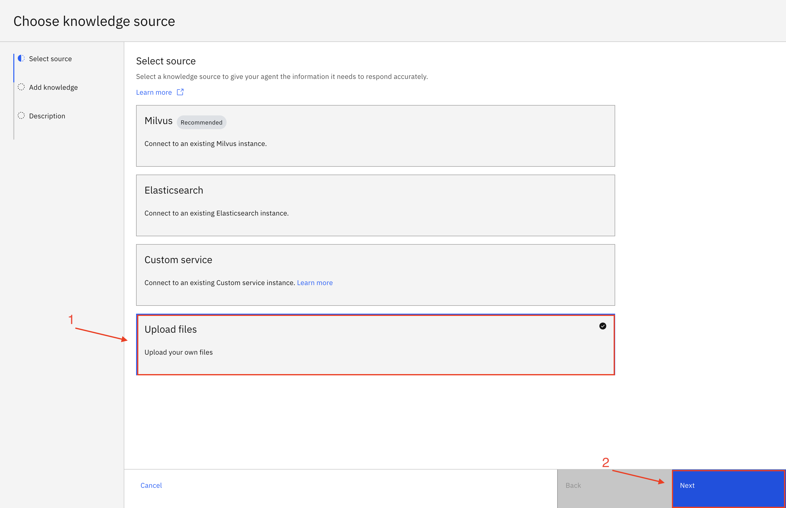
     
7. Download the [Employee Benefits.pdf](/usecases/ask-hr/assets/Employee-Benefits.pdf) onto your system, then upload the file here. You can download the pdf by clicking on [Employee Benefits.pdf](/usecases/ask-hr/assets/Employee-Benefits.pdf) and then click on download icon in opened page as shown in image below.
      

      
   Once you upload the file, Click on **Next**.

   

8. Copy the following name and description into the **Name** and **Description** sections, respectively, and then click on **Save**:

   ```
   Employee Benefits
   ```

   ```
   This knowledge base addresses the company's employee benefits, including parental leaves, pet policy, flexible work arrangements, and student loan repayment.
   ```
   
   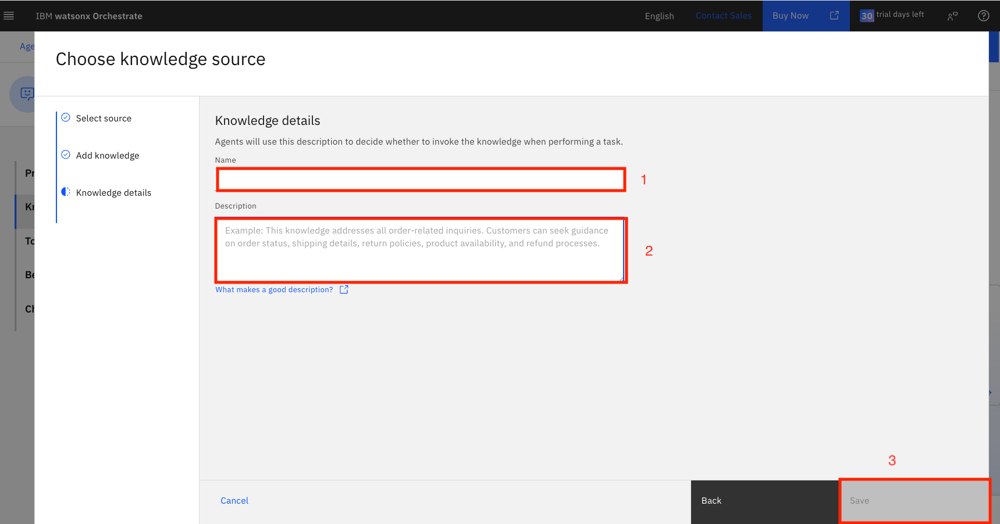

9. Scroll down to the **Toolset** section. Click on **Add tool +**:

   

10. Select **OpenAPI**:

   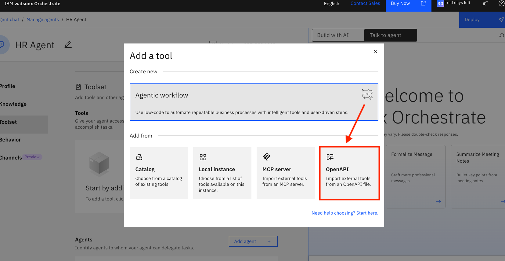


11. Drag and drop or click to upload the **hr.yaml** file (provided to you by the instructor), then click on **Next**:

       

12. Select all the operations and click on **Done**:

   

13. Scroll down to the **Behavior** section. Insert the instructions below into the **Instructions** field:

   ```
   Use your knowledge base to answer general questions about employee benefits. 

   Use the tools to get or update user specific information.

   When user asks to show profile data or check time off balance or update title/address or request time off for the very first time,  first ask the user for their name,  then invoke the tool and then use the same name in the whole session without asking for the name again.

   When the user requests time off, convert the dates to YYYY-MM-DD format, e.g. 5/22/2025 should be converted to 2025-05-22 before passing the date to the post_request_time_off tool.
   ```
14. Leave all other settings at default values and click on **Deploy** in the top right corner to deploy your agent:

   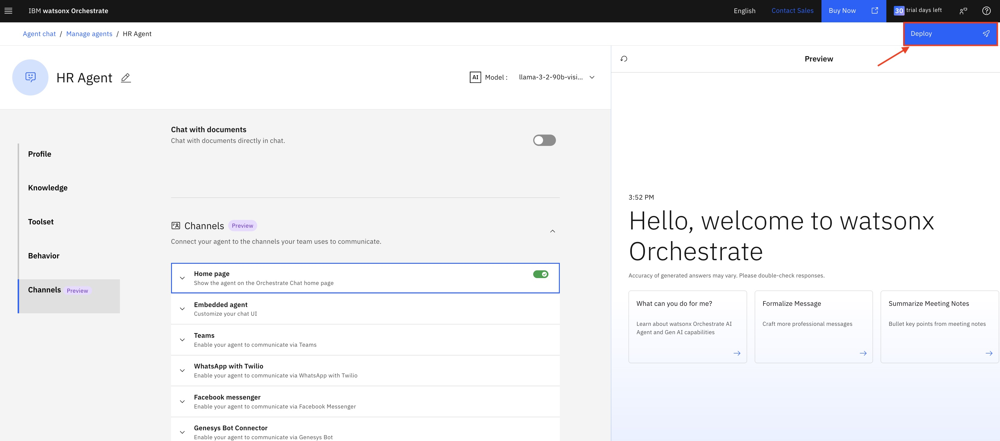

### Test HR Agent in Preview

Test the Agent from the AI Chat window. Click on the hamburger menu in the top left corner and then click on **Chat**:

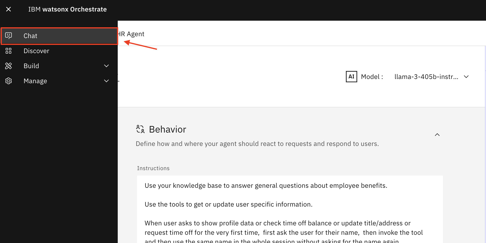

Make sure **HR Agent** is selected. You can now test your agent:

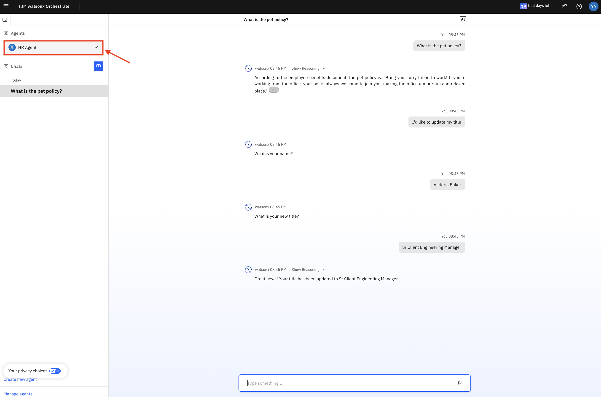

For this next part, first select an employee name from the list provided by your instructor and use it for your entire session.

Test your agent in the preview chat on the right side by asking the following questions and validating the responses.  They should look similar to what is shown in the screenshots below:

```
What is the pet policy? 
```


Next try the following prompts and refer to the image below for further interaction with the agent. 
Reminder: make sure to select an existing employee name from the list provided by your instructor and use the same employee for the entire session.


```
Show me my profile data.
```


```
I'd like to update my title. 
```


```
Update my address
```
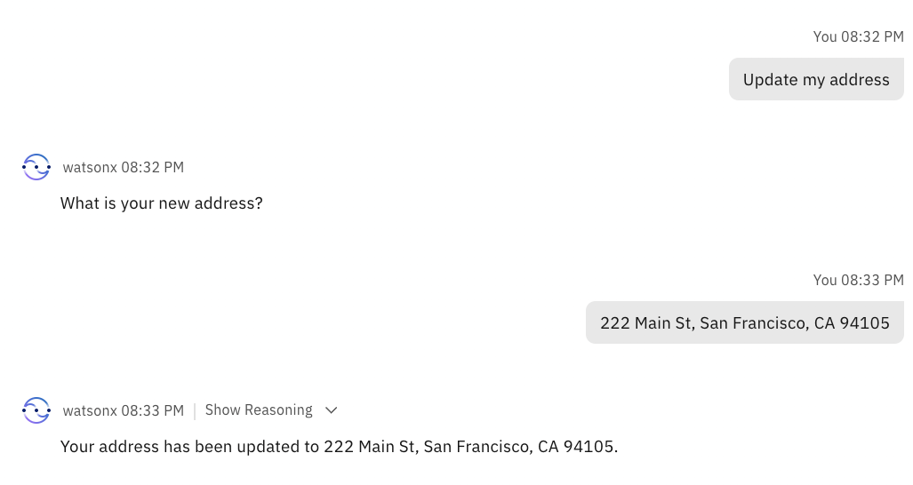

```
What is my time off balance?
```
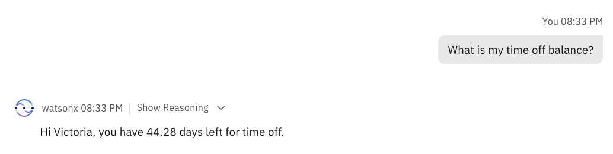

```
Request time off
```
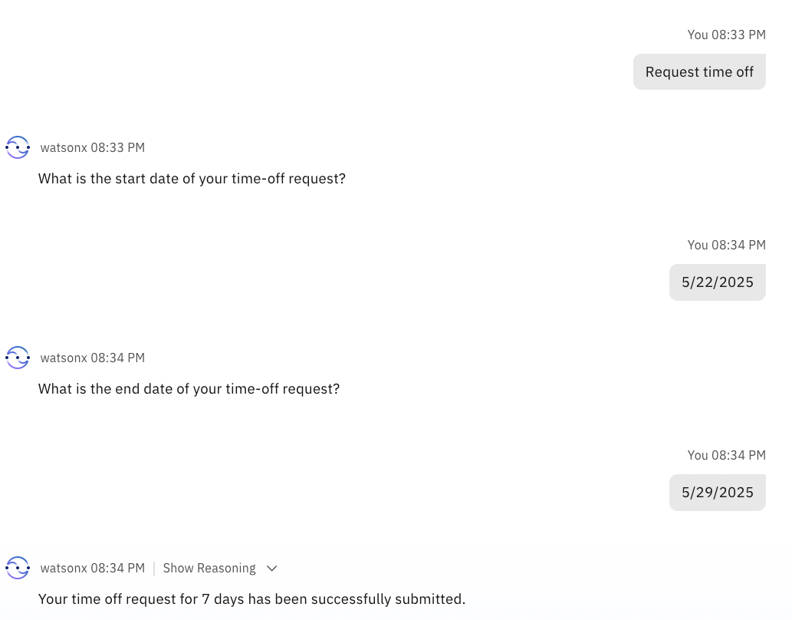

```
Show my profile data.
```


### Review Domain Agents and Tools (optional)

1. Log into the shared watsonx Orchestrate tenant (URL provided by your instructor).

2. Click on **Discover** in the main hamburger menu to go to the Catalog of agents and tools: 

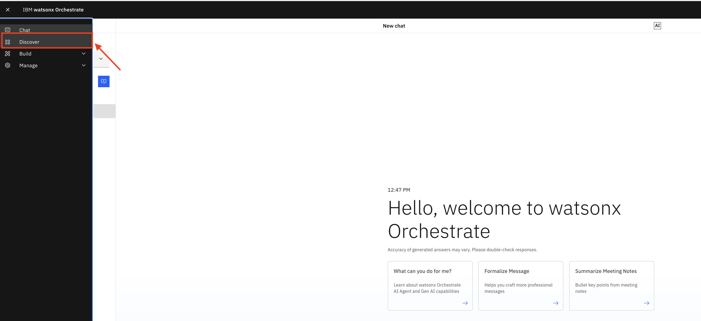

3. Here you will find a list of many pre-built agents and tools that you can filter by category (e.g. Finance, HR, IT), app (e.g. Coupa, Box, Google, etc.):

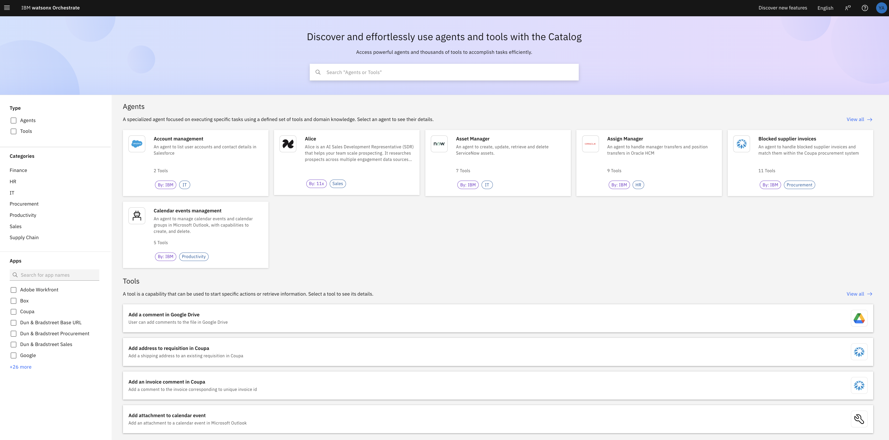

4. Take a look around, then search for the **SAP Employee Support Manager** agent and select it from the list: 

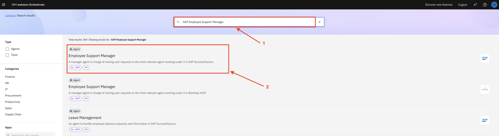

5. Notice that the supervisory agent **Employee Support Manager** includes 11 collaborator agents:

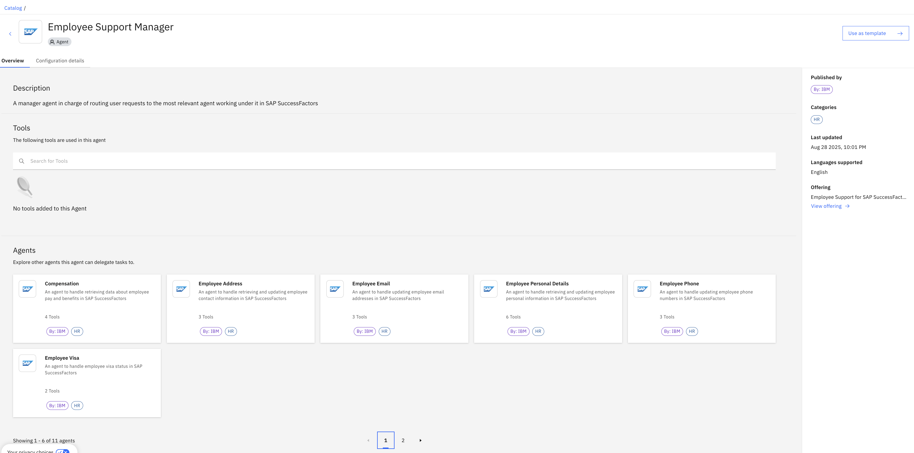

6. Click on one of them and take a look at the tools included, e.g. the **Leave Management** agent:

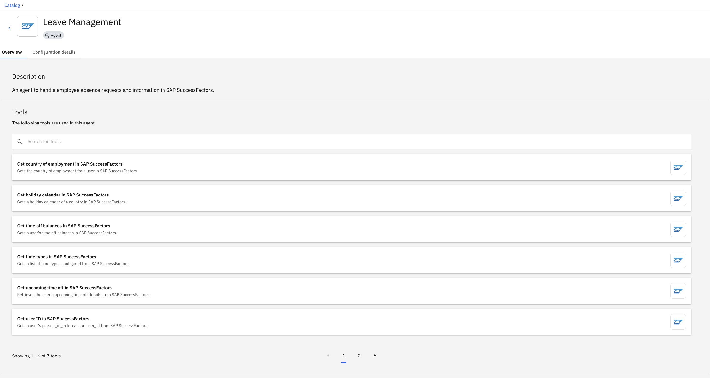

Note that it includes functionality similar to what we already implemented in our custom askHR agent.  This is outside the scope of our lab, but in a real enterprise scenario you would start from one of the pre-built domain agent templates and use it as a starting template. 

7. Go back to the Employee Support Manager Agent.  We will not use this today to avoid many multiple copies of the same agent, but notice that each pre-built agent includes the **Use as template** button in the top right corner - this is what allows you to create your own instance of the agent.  Instead of creating a new instance, we will open an existing one that was created by the instructor before the bootcamp. 
