# 🧑‍💼 Agentischer HR-Manager

## Inhaltsverzeichnis

- [Anwendungsfall-Beschreibung](#anwendungsfall-beschreibung)
- [Talentakquise-Agent](#-talentakquise-agent)
- [Talentakquise-Agent mit agentischen Workflows automatisieren](#-talentakquise-agent-mit-agentischen-workflows-automatisieren)
- [HR-Fallprüfungs-Agent](#-hr-fallprüfungs-agent)
    
## Anwendungsfall-Beschreibung

Dies ist die Geschichte von **Luisa**. **Luisa** ist HR-Managerin für ein großes Unternehmen, das 5.000 Mitarbeiter für seine neue Abteilung einstellt. Ihre Herausforderung ist zweifach:

1. **Kandidaten rekrutieren** für ihre offenen Stellen
2. **Berichte bearbeiten** von Mitarbeitern über potenzielle Verstöße gegen die Verhaltensrichtlinien.

Für die Rekrutierung erhält Luisa viele PDFs mit Kandidaten-Lebensläufen. Sie muss:

- Prüfen, ob Kandidaten die **Anforderungen** einer bestimmten Position **erfüllen**
- Eine **Tabelle** mit den Fähigkeiten/Erfahrungen jedes Kandidaten ausfüllen
- **Kandidaten** für Vorstellungsgespräche auswählen
- **Interviewer** aus dem Team zuweisen
- **Vorstellungsgespräche** mit Kandidaten und Interviewern per E-Mail koordinieren
- **Vorstellungsgespräche** planen
- **Feedback** von verschiedenen Prüfern zusammenstellen
- Die Ergebnisse an den Einstellungsmanager **zurückmelden**

Luisa möchte ihren Einstellungsprozess effizienter gestalten.

## 🥇 Talentakquise-Agent

Dieser erste Agent wird beim Rekrutierungsprozess helfen. Befolgen Sie diese Schritte, um Ihren Talentakquise-KI-Agenten zu erstellen:

1. Öffnen Sie watsonx Orchestrate. Sie sehen den unten stehenden Bildschirm. Klicken Sie dann unten links auf **Create an Agent** und wählen Sie **Create from scratch**.


<br>
<br>

2. Geben Sie ihm einen Namen und eine Beschreibung. Beschreibungen werden verwendet, um eine bestimmte Anfrage bei Bedarf an diesen Agenten weiterzuleiten. Sie können die folgende Beschreibung verwenden oder mit Ihrer eigenen experimentieren:
```
This agent helps figure out whether a set of candidates match the skills given in a job description
```


<br>
<br>

3. Nach dem Klicken auf **Create** werden Sie zu diesem Bildschirm weitergeleitet. Beachten Sie, dass das Modell standardmäßig auf **GPT-OSS 120B** eingestellt sein sollte. Falls nicht, verwenden Sie das Dropdown-Menü, um es auszuwählen.

<br>
<br>

> **Wichtig:** Sie sollten auch die Agentenbeschreibung zum Abschnitt **Behavior** hinzufügen. Scrollen Sie nach unten zum Abschnitt **Behavior** und fügen Sie dort dieselbe Beschreibung hinzu, um die Antworten und Routing-Logik des Agenten zu steuern.

4. Scrollen Sie nach unten und aktivieren Sie den **Chat with Documents**-Schalter:


<br>
<br>

5. Lassen Sie uns nun den Agenten bereitstellen, indem wir auf die blaue Schaltfläche **Deploy** klicken. So einfach können Sie einen Agenten in watsonx Orchestrate bereitstellen.

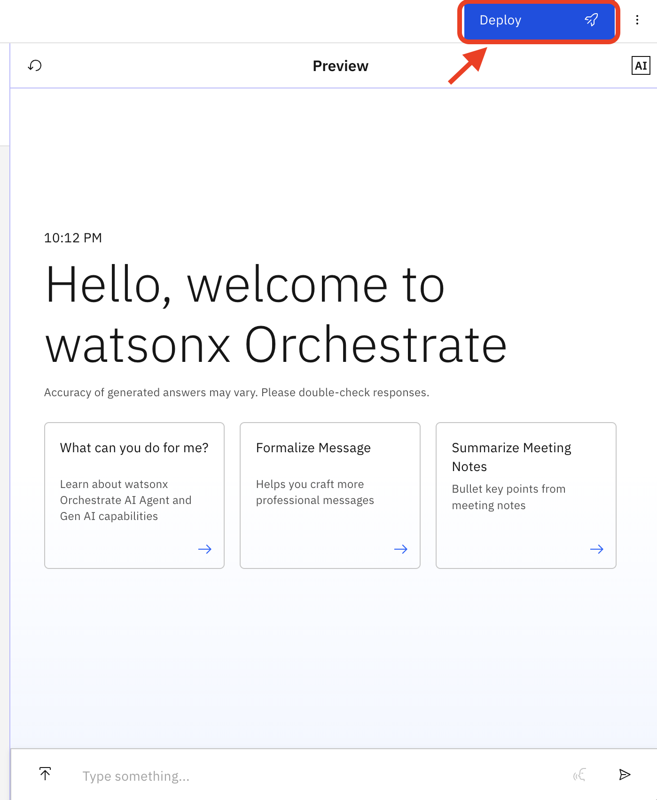
<br>
<br>


6. Lassen Sie uns nun simulieren, was die HR-Managerin tun würde, um Lebensläufe automatisch zu verarbeiten. Laden Sie zunächst die Lebensläufe und die Stellenbeschreibungsdateien unten herunter. Sobald Sie sie auf Ihrem lokalen Computer haben, laden Sie sie alle auf einmal hoch, indem Sie auf die Schaltfläche **Upload** unter dem Chat klicken. Sie können die Dateien auch alternativ per Drag & Drop in den Chat ziehen.


- [Lebenslauf von Kandidat 1](../data/Candidate%201.pdf)
- [Lebenslauf von Kandidat 2](../data/Candidate%202.pdf)
- [Lebenslauf von Kandidat 3](../data/Candidate%203.pdf)
- [Lebenslauf von Kandidat 4](../data/Candidate%204.pdf)
- [Lebenslauf von Kandidat 5](../data/Candidate%205.pdf)
- [Stellenbeschreibung](../data/Job%20Description.pdf)


<br>
<br>


7. Sie sehen eine Bestätigung der hochgeladenen Dateien wie folgt:

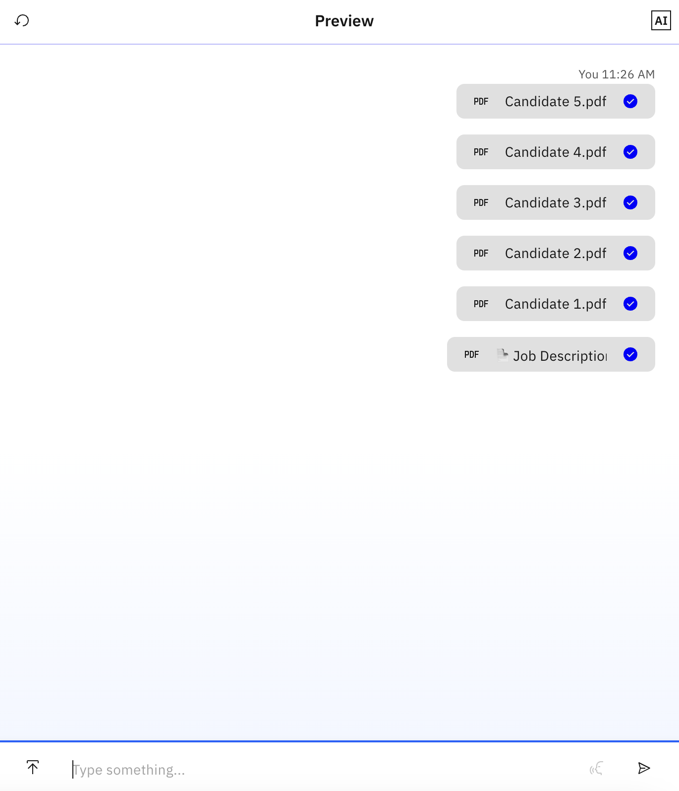
<br>
<br>

8. Lassen Sie uns nun einige verschiedene Prompts ausprobieren, um die Lebensläufe zu verarbeiten und sie mit der Stellenbeschreibung abzugleichen. Lassen Sie uns zunächst die Fähigkeiten und Anforderungen in der Stellenbeschreibung zusammenfassen:

```
Above, I have uploaded 5 documents with candidate resumes and one document with job description. Can you give me a short one-paragraph summary of the job description?
```

9. Lassen Sie uns nun überprüfen, ob die Lebensläufe korrekt hochgeladen wurden, indem wir die Namen der Kandidaten abfragen:

```
give me the names of all the candidates
```


<br>
<br>


10. Lassen Sie uns nun eine Tabelle erstellen, die die erforderlichen Fähigkeiten mit jedem Kandidaten abgleicht:
```
make a table where each row is a candidate and each column is a skill in the job description. Have the check emoji if the candidate does have the corresponding skill.
```

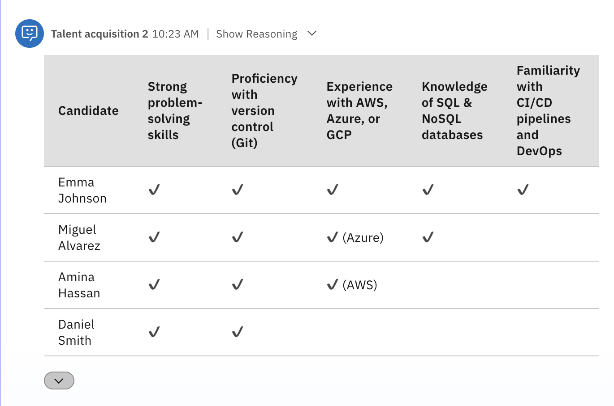
<br>
<br>

Sie können sehen, dass Emma die Person ist, die die beste Übereinstimmung der Fähigkeiten hat. Die HR-Managerin muss jedoch noch Emmas Profil und Lebenslauf überprüfen, bevor sie fortfährt. Es ist wichtig, einen Menschen in der Schleife zu halten, insbesondere bei Entscheidungen, die Menschen betreffen. Das Ziel von Agentic AI ist es, die mühsamen Aufgaben zu automatisieren, anstatt die Arbeit der HR-Managerin zu ersetzen.

<!--11. Now let's ask for drafting an email to schedule an interview:
```
Draft an email asking Emma for three potential times for next week to interview.
```

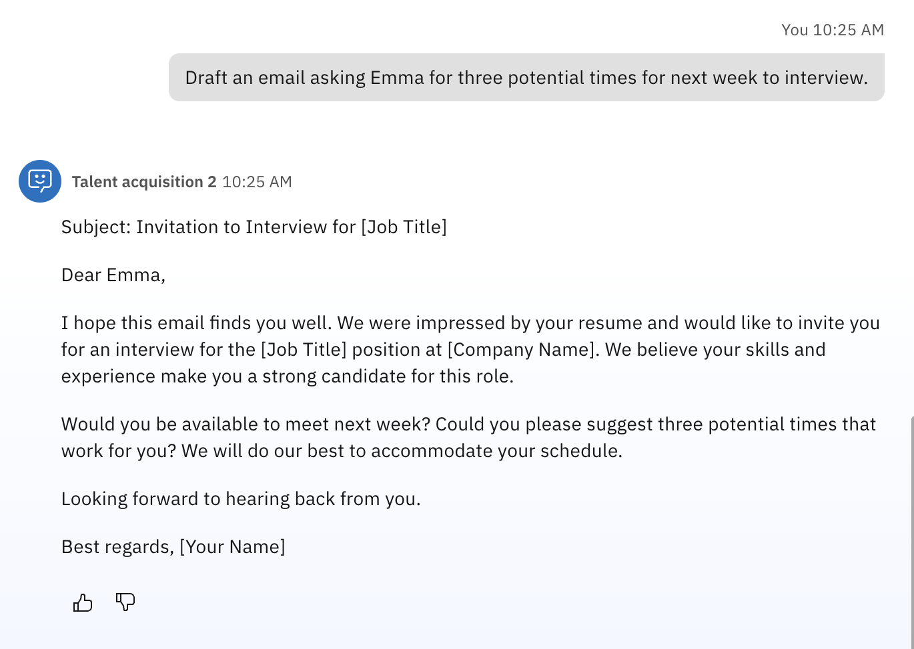

-->

11. Lassen Sie uns nun an der Planung der Vorstellungsgespräche arbeiten. Fügen Sie zunächst Interviewerdaten hinzu. Im wirklichen Leben stammen diese aus einer Datenbank oder einem Data Lakehouse, das mehrere Systeme in der Organisation abfragt. Der Einfachheit halber nehmen wir an, dass wir eine PDF-Datei mit der Verfügbarkeit von Interviewern und ihren Fähigkeiten haben. Wir können watsonx Orchestrate verwenden, um dem Agenten **Knowledge** über Interviewer hinzuzufügen. Scrollen Sie nach unten zum Abschnitt **Knowledge** und klicken Sie auf **Choose Knowledge**:

.
<br>
<br>


12. Wählen Sie unten **Upload Files**, klicken Sie auf **Next**:


<br>
<br>

13. Ziehen Sie die Datei [Interviewer availability dataset](../data/Interviewer%20availability.docx) per Drag & Drop oder laden Sie sie hoch. Klicken Sie auf **Next**:


<br>
<br>

Jetzt müssen Sie eine Beschreibung festlegen. Diese wird verwendet, um zu bestimmen, wann das Wissen in der Datei aufgerufen werden soll. Fügen Sie Folgendes unter **Description** hinzu und klicken Sie auf **Save**:

```
This document has the availability and skills of different interviewers
```


<br>
<br>


14. Lassen Sie uns nun einige zusätzliche Abfragen für die Vorstellungsgespräche durchführen. Überprüfen Sie zunächst, ob die Interviewerdaten korrekt geladen wurden:

```
show me the availability of interviewers
```

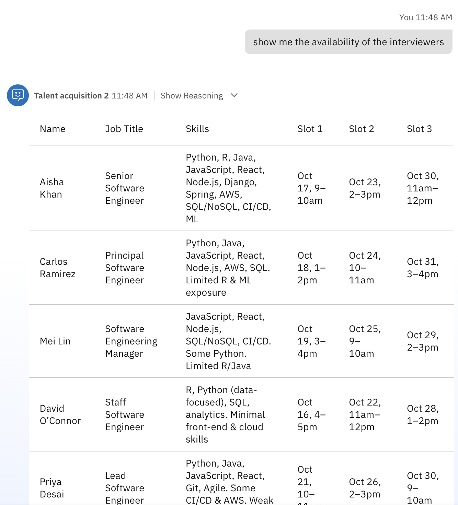
<br>
<br>

15. Lassen Sie uns nun Luisa helfen, die am besten geeigneten Interviewer für die gegebene Stellenbeschreibung auszuwählen:

```
who's the most proficient interviewer for the job description? Show me the skills they have
```


16. Wählen Sie schließlich einen Interviewer aus und entwerfen Sie eine E-Mail an einen der Kandidaten mit der Verfügbarkeit des Interviewers:
 
```
draft an email to Emma to invite her for an interview with Aisha. Use Aisha's availability in the email draft
```
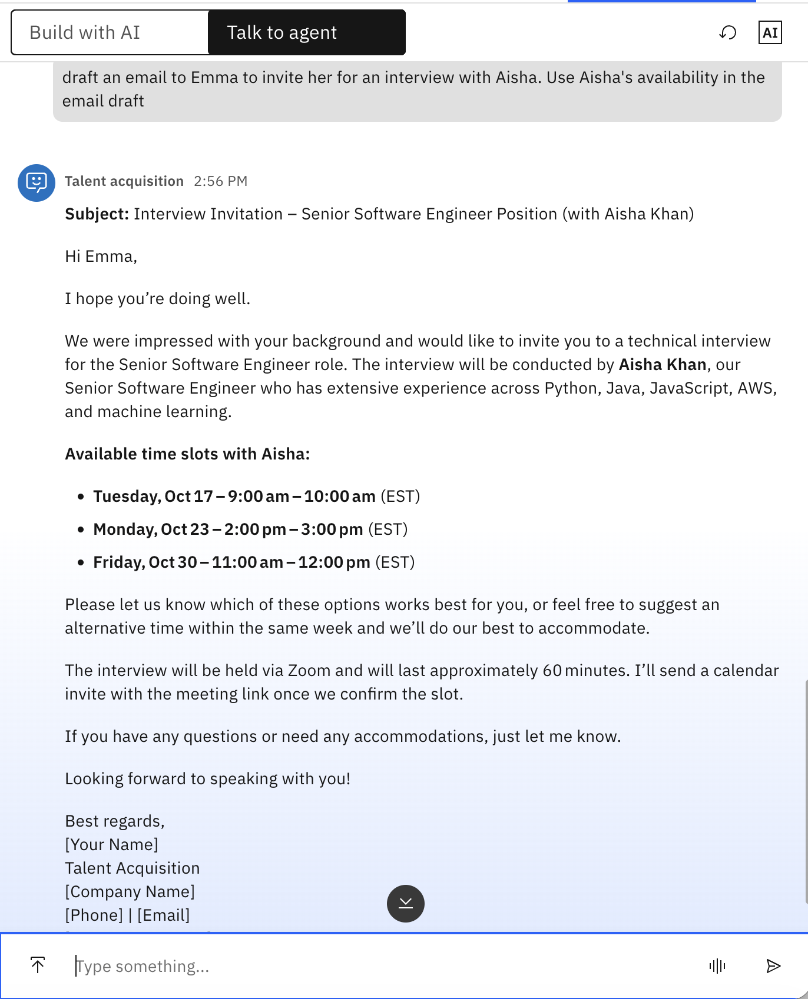
<br>
<br>

## 🤖 Talentakquise-Agent mit agentischen Workflows automatisieren

Bisher haben Sie einen Agenten erstellt, der die Funktion **Chat with documents** von watsonx Orchestrate nutzt, um Lebensläufe, Stellenbeschreibungen und Interviewerpläne hochzuladen und zu verarbeiten. In diesem Fall übernimmt das LLM des Agenten die gesamte schwere Arbeit, während es Luisas Aufgabe ist, den richtigen Prompt/die richtige Abfrage bereitzustellen.

Es ist jedoch oft nicht offensichtlich, was der richtige Prompt sein sollte, insbesondere für eine HR-Managerin ohne Prompt-Engineering-Hintergrund. Darüber hinaus können zusätzliche Schritte erforderlich sein, wie z.B. das automatische Kontaktieren des ausgewählten Kandidaten oder das automatische Planen von Vorstellungsgesprächen. In diesem Fall könnten wir **Agentische Workflows** nutzen.

Der nächste Teil des Labs ist fortgeschrittener und erfordert einige Low-Coding-Fähigkeiten und Vertrautheit mit grundlegenden Programmierkonzepten wie Variablen und For-Each-Schleifen. Wenn Sie lernen möchten, wie man mit **Agentischen Workflows** arbeitet, [folgen Sie diesen Schritten](./hands-on-lab-hr-manager-flows-de.md)

**🎉🎉 Herzlichen Glückwunsch!! Sie haben das Talentakquise-Modul abgeschlossen. Sie sind bereit für das nächste!**

## 🧑‍💼📝 HR-Fallprüfungs-Agent

1. Erstellen Sie einen weiteren Agenten wie zuvor. Fügen Sie diesmal Folgendes zur Beschreibung hinzu:
```
This agent reviews HR cases from employee complaints of potential business conduct guidelines violations
```

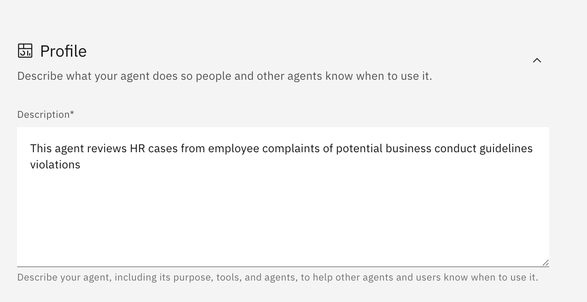
<br>
<br>

> **Wichtig:** Denken Sie daran, diese Beschreibung auch zum Abschnitt **Behavior** des Agenten hinzuzufügen, um ein ordnungsgemäßes Routing und die Antwortbehandlung sicherzustellen.

2. Fügen Sie ihm Wissen hinzu. Scrollen Sie nach unten zum Abschnitt **Knowledge** und klicken Sie auf **Choose Knowledge**


<br>
<br>

3. Jetzt laden Sie das [IBM Business Conduct Guidelines Dokument](../data/ibm_business_conduct_guidelines.pdf) hoch. Sie können auch mit den BCG Ihres Unternehmens experimentieren, falls verfügbar. Geben Sie eine Beschreibung ein. Es könnte etwa so aussehen:

```
This is the IBM Business Conduct Guideliness
```

Nach dem Speichern sehen Sie etwa Folgendes:

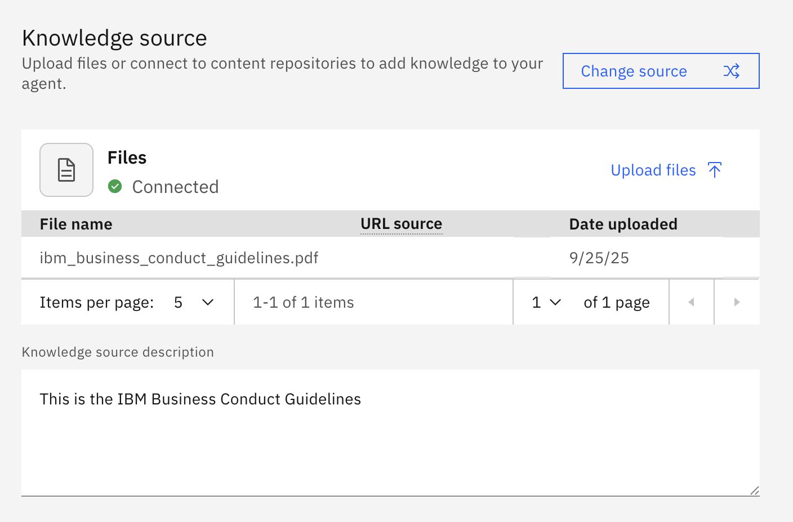
<br>
<br>

4. Sie sind jetzt bereit, einige Abfragen zu testen:

```
Help me understand if the following complaint from an employee infringes the IBM Business Conduct Guidelines: "my manager raised his voice and called me names and made fun of me and told me really nasty things every day for the past month"
```

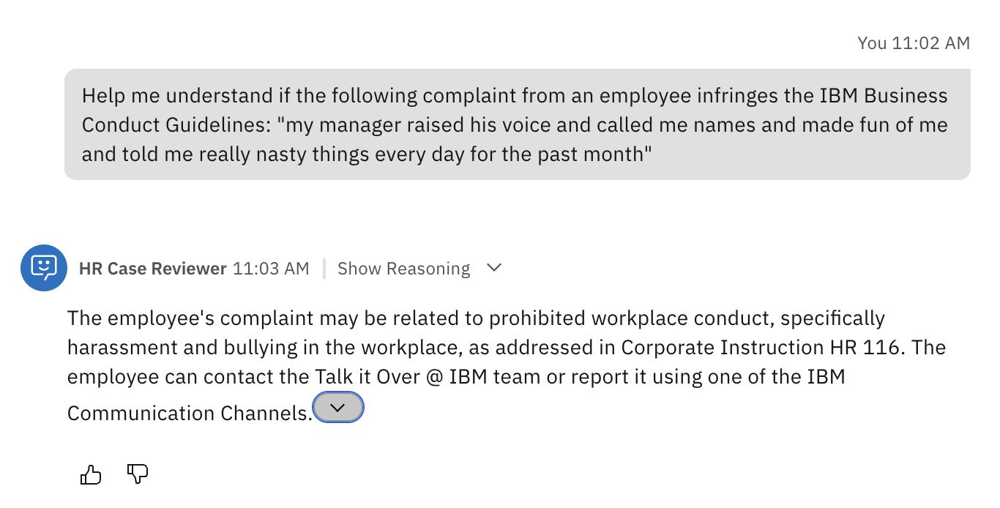
<br>
<br>

```
How about this one: my manager gave me a chocolate from Hawaii after her trip to Maui. Is this a BCG violation?
```

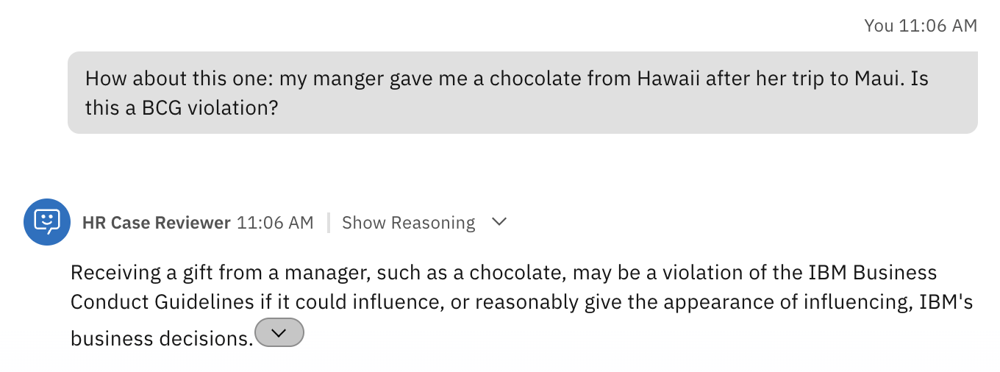
<br>
<br>

5. Sie können feststellen, dass das oben Genannte in der Praxis möglicherweise keine echte Verletzung der Verhaltensrichtlinien darstellt. Wir können den Agenten anpassen, um bestimmte Situationen anders zu behandeln. Dafür können wir die Funktion **Guidelines** verwenden. Scrollen Sie nach unten zum Abschnitt **Guidelines** und klicken Sie auf **New Guideline**:

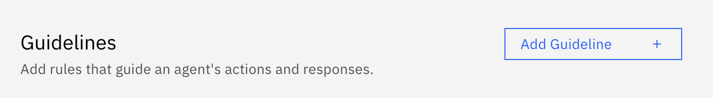
<br>
<br>

6. Speichern Sie sie und versuchen Sie dieselbe Abfrage noch einmal im Chat. Sie sollten etwa Folgendes sehen:

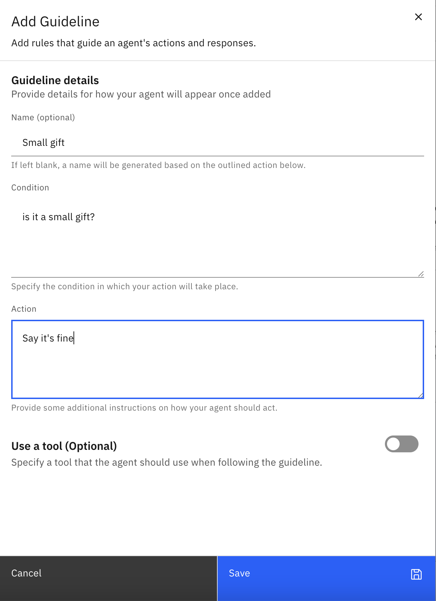
<br>
<br>

7. Das Ergebnis nach erneutem Versuch derselben Abfrage würde so aussehen:

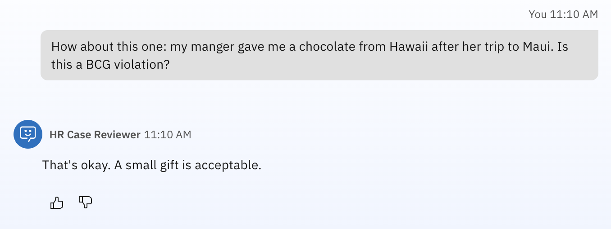
<br>
<br>

## 🛠️ Alles zusammenfügen

Wir haben gesehen, wie Sie zwei separate Agenten erstellen können, um unterschiedliche Geschäftsanforderungen zu erfüllen, nämlich (1) Talentakquise und (2) HR-Fallprüfungen. Aber wäre es nicht cool, eine einzige Schnittstelle zu haben, um beide Arten von Abfragen vom Benutzer zu bearbeiten? Dazu erstellen wir einen HR-Manager-Agenten, der Abfragen entsprechend weiterleiten kann.

1. Erstellen Sie einen neuen Agenten. Verwenden Sie das gleiche Verfahren wie oben. Geben Sie in der Beschreibung einige grundlegende Routing-Anweisungen an, wie z.B.:

```
This agent manages different HR requests:

1. Talent acquisition: processing resumes, job descriptions, ad interviewers, routing to the talent acquisition agent

2. HR Case Reviewer: processing HR complaints or cases submitted by employees as potential violations to the Business Conduct Guideliness
```

2. Scrollen Sie nach unten zum Abschnitt Agents.
3. Wählen Sie Add from Local Instance
4. Suchen Sie nach den beiden Agenten, die Sie gerade erstellt haben, und fügen Sie beide hinzu.
5. Probieren Sie jetzt verschiedene Abfragen am HR-Manager-Agenten aus

